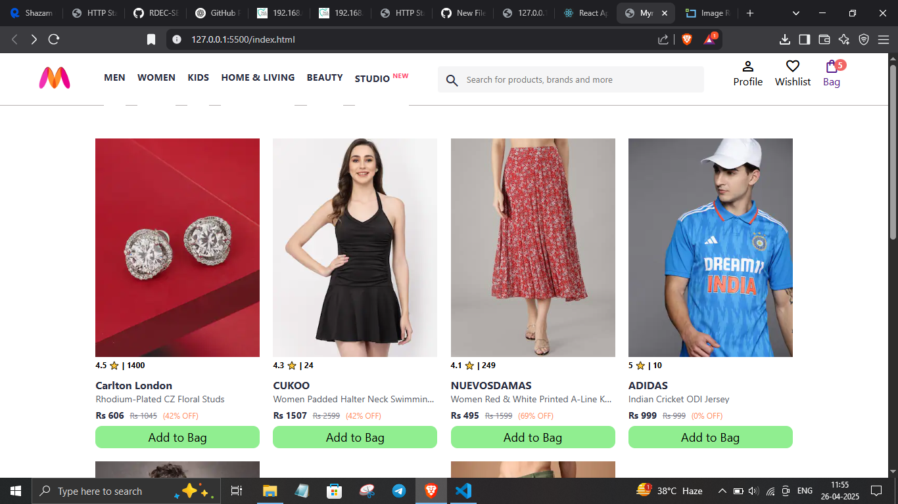

# 🛍️ Myntra Clone

This is a front-end clone of the popular e-commerce website **Myntra**, built using **HTML**, **CSS**, and **JavaScript**.  
It replicates the look and feel of the original website with a focus on responsive design and user interface experience.

---

## 🔧 Technologies Used

- **HTML5** – For page structure
- **CSS3** – For styling and responsive layout
- **JavaScript** – For interactivity

---

## ✨ Features

- Beautiful and responsive homepage
- Product listings and category sections
- Navigation bar with search functionality
- Hover effects and interactive elements
- Mobile-friendly design

---

## 📸 Screenshots


### 🖼️ Home Page  


---

## 🚀 Getting Started

1. **Clone the repository**
   ```bash
   git clone https://github.com/your-username/myntra-clone.git
